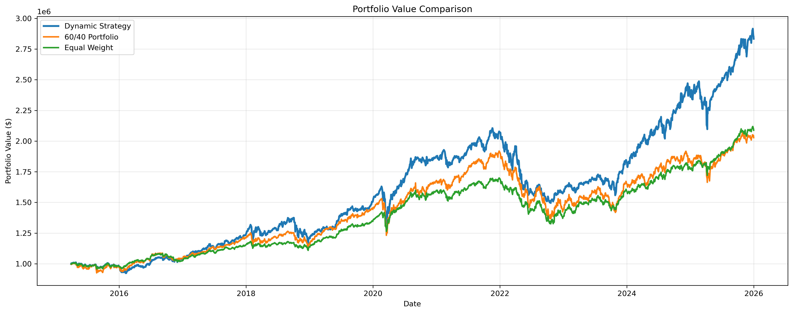
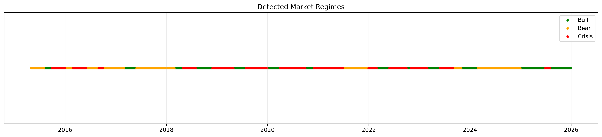
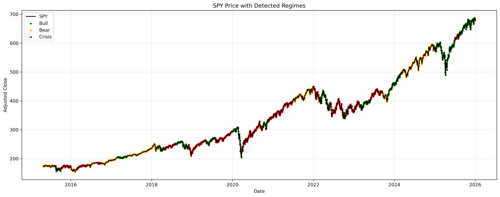
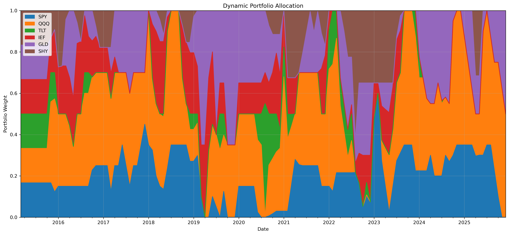
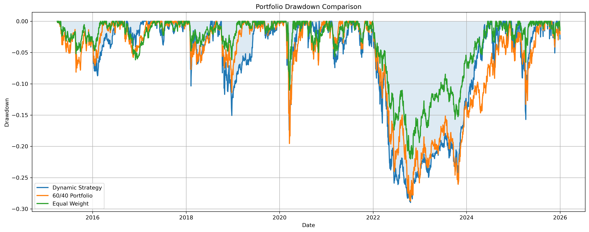
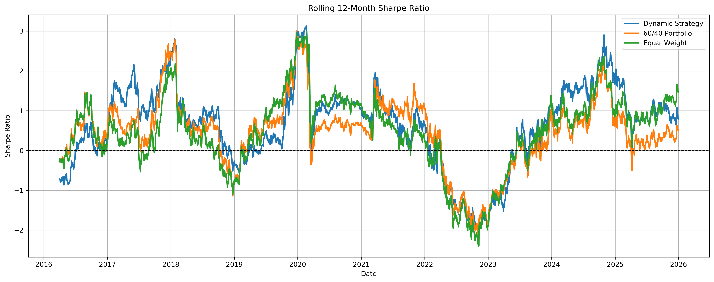
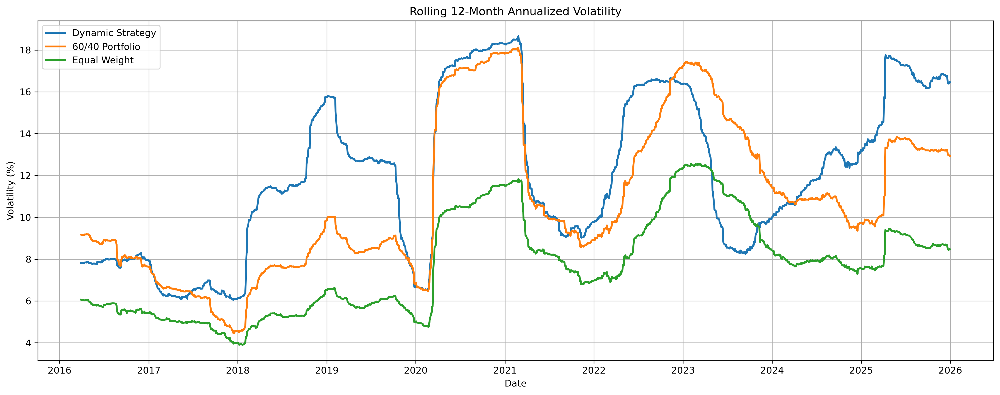
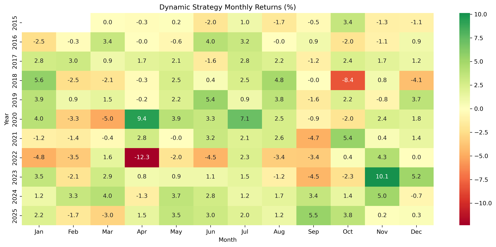
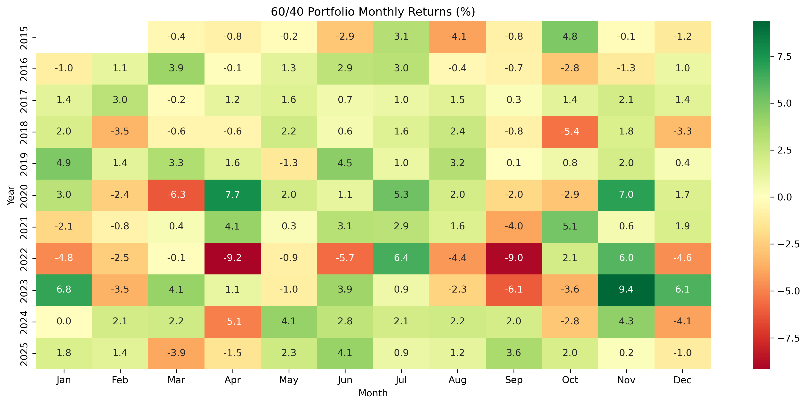
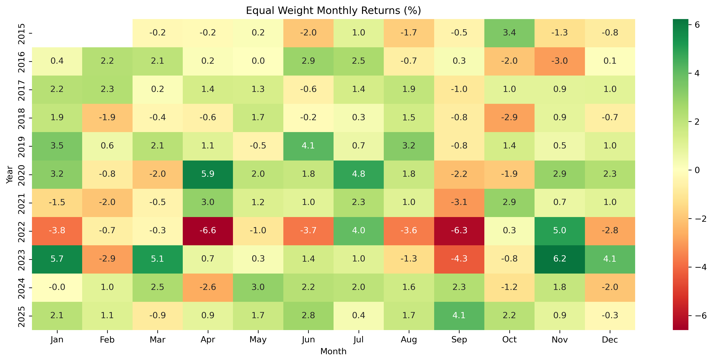

# Macro-Aware Tactical Asset Allocation Engine

A regime-switching portfolio strategy that uses a Hidden Markov Model to figure out what kind of market we're in (Bull, Bear, or Crisis) from returns, VIX, and a few macro indicators, then rebalances across equities, bonds, and gold accordingly. The whole thing is a walk-forward pipeline - data in, features out, HMM detects the regime, a convex optimizer picks weights, then it backtests and reports on itself. Tried to be careful about look-ahead bias and about the strategy trading too much just because it can.

| | |
|---|---|
| **Assets** | SPY, QQQ, TLT, IEF, GLD, SHY |
| **Benchmarks** | 60/40 (SPY/TLT), Equal Weight |
| **Rebalancing** | Monthly |
| **Backtest Period** | 2015-03 → 2025-12 (after a 5-year training window) |
| **Hidden States** | 3 (Bull, Bear, Crisis) |

---

## Goals Compliance

| Goal | Status | Notes |
|---|---|---|
| HMM regime classifier (no manual labelling) | ✅ | 3-state Gaussian HMM, states get mapped to Bull/Bear/Crisis using mean VIX and mean SPY return each retrain |
| Dynamic constraint mapping by regime | ✅ | Risk aversion, max weight, turnover budget all change depending on the detected regime |
| Walk-forward validation, no look-ahead | ✅ | Expanding-window retraining, regime signal shifted forward a period, weights applied from T+1 |
| Transaction friction modelling | ✅ | 5 bps/trade, L1 turnover penalty + a turnover cap that's actually binding now |
| Bear/Crisis tail-risk floor | ✅ | Floor on SHY/IEF/GLD now applies in Bear too, not just Crisis - soft constraint so it doesn't fight the turnover cap |
| Benchmarked vs. static portfolios | ✅ | 60/40 and Equal Weight, same trading window as the strategy |
| Full tear sheet (Sharpe/Sortino/Calmar/turnover/VaR/CVaR/Ulcer Index) | ✅ | See Results |
| Documented transition probabilities | ✅ | See Regime Detection Quality |

---

## Getting Started

1. **Clone the repo**
   ```bash
   git clone https://github.com/AbhishriyaSingh/RegimeShift-Quant.git
   cd RegimeShift-Quant
   ```
2. **Install dependencies**
   ```bash
   pip install -r Requirements.txt
   ```
3. **FRED API key** - grab a free one at https://fred.stlouisfed.org/docs/api/api_key.html, then:
   ```bash
   cp config.example.py config.py
   ```
   and put your key in `config.py`. That file is gitignored, so it never gets committed - each tester/user keeps their own key locally.
4. **Run it**
   ```bash
   jupyter notebook RegimeShiftProj.ipynb
   ```
   Restart Kernel → Run All for a clean run. Everything - weights, regimes, equity curves, transition matrix, drawdowns, rolling metrics, defensive-floor diagnostics - gets written to `results/` as CSVs, and the charts go to `assets/`.

---

## Methodology

### 1. Data & Features
Daily prices for the six assets plus VIX come from `yfinance`. CPI, Fed funds rate, and 2Y/10Y yields come from FRED. Macro series get lagged before use (CPI by about a month, yields by a day) since that's roughly how late this data actually shows up in the real world - the model shouldn't get to see numbers before they existed.

Features going into the HMM: `SPY_Return`, `TLT_Return`, `GLD_Return`, `VIX_Change`, `Yield_Spread`, `SPY_Volatility`.

### 2. Regime Detection (HMM)
Using a `GaussianHMM`, 3 states, diagonal covariance. Tried `full` covariance first and it overfit badly on ~5 years of daily data; `tied` flattened out the volatility signal that actually separates Bull from Bear, so diagonal won out.

Retrains every `RETRAIN_EVERY_MONTHS` (currently 3) on an expanding window - all data strictly before the retrain date, nothing after. Each retrain fits 5 times with different seeds and keeps whichever run has the best likelihood, mostly to avoid getting stuck wherever EM happened to converge first.

The raw state numbers the HMM spits out don't mean anything on their own and can flip between retrains, so states get remapped every time based on which one has the highest mean VIX (that's Crisis) and which of the remaining two has the higher mean SPY return (that one's Bull). Never assumed a fixed state index = fixed label.

There's also a confirmation rule before a regime switch is accepted - needs 2 consecutive months of the new regime (1 month if it's Crisis, since you don't want to sit around waiting while things fall apart). Cuts down on whipsawing from a single noisy month.

### 3. No Look-Ahead Bias
Regime signals get shifted forward by one period before they're used - so a regime picked up from data through month-end T only starts affecting the portfolio in month T+1, never T itself. Same idea for the optimizer's inputs (expected returns, covariance) - only data before the rebalance date goes in. And the backtest applies new weights starting the trading day *after* the decision, not the same day, so the strategy can't accidentally "earn" the return that was used to make the decision.

### 4. Regime-Aware Optimization
Each rebalance solves a mean-variance problem (`cvxpy` + OSQP), with a few things varying by regime:

- **Expected returns** are a blend of a regime-conditional EWMA and the long-run average, shrunk harder toward the long-run average in Bear/Crisis so the optimizer doesn't overreact to a couple of noisy months.
- **Covariance** uses Ledoit-Wolf shrinkage, blended with a downside-only estimate, so co-crash risk gets penalized more than plain volatility does.
- Risk aversion, max single-asset weight, and turnover budget all loosen up in Bull and tighten in Bear/Crisis.
- **Turnover friction**: L1 penalty plus a hard cap. The optimizer's actual solution gets applied each time now, no smoothing on top - so the cap is a real constraint on how much the portfolio can trade, not just a number that looks good on paper.
- **Defensive floor**: minimum combined SHY/IEF/GLD allocation, 50% in Crisis and 30% in Bear now. It's a soft constraint (slack variable with a heavy penalty) rather than a hard one, since a hard floor plus the turnover cap can genuinely have no feasible solution if the portfolio's too far from compliant. If the turnover budget can't get there in one step, the slack absorbs it that period and it closes the gap over the next rebalance or two instead of the solver just failing.

### 5. Benchmarking
60/40 and Equal Weight get computed over the same window the strategy actually trades (2015-03 onward) - otherwise they'd get extra years of compounding for free that the strategy never had a chance to participate in.

---

## Recent Improvements

A few things got fixed after the first version:

1. **Retrain cadence parameter wasn't actually wired up** - there was a `RETRAIN_EVERY_MONTHS` setting in the config cell, but the walk-forward loop had its own separate hardcoded value, so changing the config did nothing. Now there's one variable and it's used everywhere.
2. **Turnover cap wasn't really the constraint it looked like** - weights were getting blended 90/10 with the previous period's weights after the optimizer solved, which quietly pulled realized turnover below what the regime budgets should've allowed. That blending step is gone now.
3. **Bear regime had no defensive floor** - only Crisis did, so a slow correlated selloff like 2022 (not a VIX spike, just everything grinding down together) never triggered any protection. Bear now gets a 30% floor, done as a soft constraint so it can't conflict with the turnover cap.
4. **Tear sheet only had Max Drawdown for tail risk** - added Daily VaR (95%), Daily CVaR (95%), and Ulcer Index, since Max Drawdown alone only tells you about the single worst point and nothing about how bad or how long the rest of the drawdowns were.

Effect on everything else, holding the strategy otherwise constant:

| Metric | Before | After |
|---|---|---|
| Sharpe Ratio | 0.454 | **0.507** |
| Sortino Ratio | 0.553 | **0.615** |
| Maximum Drawdown | -31.81% | **-26.36%** |
| Calmar Ratio | 0.317 | **0.381** |
| Annual Volatility | 13.41% | **11.91%** |
| Average Turnover | 22.04% | 28.77% |

CAGR and final value barely moved (10.04% vs 10.09%) - the gain here is risk reduction, not extra return. Turnover went up simply because it's the real, unsmoothed number now rather than an artifact of the blending that got removed.

*(This table is a snapshot from the run right after these fixes landed. The Results table below is from a later run - small differences like 0.507 vs 0.496 Sharpe are just normal `yfinance`/FRED data revision drift between runs, not a regression.)*

---

## Results (2015-03 → 2025-12)

| Metric | Dynamic Strategy | 60/40 Portfolio | Equal Weight |
|---|---|---|---|
| Final Value | **$2,833,623.07** | $2,027,870.31 | $2,088,171.06 |
| Cumulative Return | **183.36%** | 103.69% | 109.33% |
| CAGR | **10.19%** | 6.85% | 7.12% |
| Annual Volatility | 12.46% | 11.31% | 7.94% |
| Sharpe Ratio | **0.496** | 0.252 | 0.393 |
| Sortino Ratio | **0.593** | 0.316 | 0.524 |
| Maximum Drawdown | -28.97% | -28.74% | **-22.01%** |
| Calmar Ratio | **0.352** | 0.238 | 0.324 |
| Daily VaR (95%) | 1.19% | 1.11% | **0.77%** |
| Daily CVaR (95%) | 1.97% | 1.72% | **1.17%** |
| Ulcer Index | 9.80% | 9.23% | **6.03%** |
| Average Turnover | 29.81% | – | – |

*(Sharpe/Sortino computed on excess returns over a 4% risk-free rate.)*

The strategy still beats both benchmarks on CAGR, Sharpe, Sortino, and Calmar after costs. Its Maximum Drawdown, though, is no longer better than 60/40's — at -28.97% it's now marginally *worse* than 60/40's -28.74%, a reversal from an earlier run where the strategy held a clear edge there (-26.36% vs -28.74%). Equal Weight remains the lowest-drawdown option on the table. This move came from a fresh full re-run (updated FRED key, revised live macro/VIX data reshaping the HMM's regime path), not a code change — see the In-Sample / Out-of-Sample Check below, which surfaces a related and more concerning pattern. See Future Improvements below for what's still on the list.



### Regime Detection Quality

Latest HMM transition matrix (rows = current state, columns = next state):

| | Bull | Bear | Crisis |
|---|---|---|---|
| **Bull** | 0.9756 | 0.0000 | 0.0244 |
| **Bear** | 0.0000 | 0.9873 | 0.0127 |
| **Crisis** | 0.0610 | 0.0304 | 0.9087 |

All three states are pretty sticky (>90% on the diagonal), which is a decent sign the model's picking up real market states and not just noise. Across the whole backtest: 51 Crisis, 40 Bull, 39 Bear checkpoints. None of the recent fixes touch regime detection itself - only the weighting layer changed - so these numbers are unaffected.




### Portfolio Allocation

How the strategy rotates between equities (SPY/QQQ), duration (TLT/IEF), gold, and cash (SHY) over time:



### Drawdown & Rolling Risk





### Monthly Returns

<table>
<tr><td></td>
<td></td>
<td></td></tr>
</table>

---

## Repository Structure
```
├── RegimeShiftProj.ipynb      # data → HMM → optimization → backtest → reporting
├── Requirements.txt
├── config.example.py          # copy to config.py and add your own FRED key, see setup step 3
├── config.py                  # gitignored - created locally, never committed
├── results/                   # CSVs written on each run
├── assets/                    # chart images used in this README
└── README.md
```

## In-Sample / Out-of-Sample Check

Every regime-specific constant in this project (γ per regime, turnover caps, weight caps, the 30%/50% Bear/Crisis defensive floors, the EWMA/long-run shrinkage weights) was picked once, by looking at performance over the whole 2015-2025 backtest. That's functionally the same problem as fitting on your test set - so this was the biggest open question about whether the Results table above can be trusted at face value.

Block 13B in the notebook now splits the backtest at `OOS_SPLIT_DATE` (currently 2022-01-01) and reports the exact same tear sheet - CAGR, Sharpe, Sortino, Max Drawdown, Calmar, VaR/CVaR, Ulcer Index - separately for the in-sample period (2015-03 to 2021-12) and the out-of-sample period (2022-01 onward), for all three portfolios. Nothing gets re-fit for the out-of-sample period; the same fixed parameters just get evaluated on data that wasn't used to pick them.

**Dynamic Strategy — In-Sample (2015-03 → 2021-12) vs. Out-of-Sample (2022-01 → 2025-12):**

| Metric | In-Sample | Out-of-Sample | Change |
|---|---|---|---|
| Sharpe Ratio | 0.654 | 0.294 | **-55.0%** |
| Sortino Ratio | 0.732 | 0.389 | **-46.9%** |
| CAGR | 11.36% | 8.21% | -27.7% |
| Maximum Drawdown | -18.21% | -27.76% | **+52.4% deeper** |
| Calmar Ratio | 0.624 | 0.296 | **-52.6%** |
| Ulcer Index | 3.84% | 14.35% | **+273.7%** |

This is the overfitting signature the split exists to catch, not a close call. Out-of-sample Sharpe and Calmar both fall by more than half, and the Ulcer Index — which captures both depth and duration of drawdowns — nearly quadruples. CAGR out-of-sample is still positive (8.21%), so the strategy didn't stop making money, but the risk-adjusted edge that the full-period Results table advertises is substantially weaker on the data these regime parameters weren't tuned against.

For context, both static benchmarks degraded at least as much over the same split: 60/40's Sharpe collapsed from 0.608 in-sample to **-0.174** out-of-sample (CAGR 10.12% → 1.71%), and Equal Weight's Sharpe fell from 0.602 to 0.164 (CAGR 8.16% → 5.55%). 2022-2025 was a harder regime for every portfolio here, largely because of the 2022 rate shock breaking the usual stock/bond diversification benefit — so part of the Dynamic Strategy's decline reflects a genuinely tougher market, not pure curve-fitting. But that context cuts both ways: defending against exactly this kind of regime is the strategy's core pitch, and on that count the out-of-sample numbers show real, not cosmetic, degradation.

## Future Improvements

- Calibrate the Bear/Crisis floor levels (30%/50%) and the slack penalty from data instead of picking reasonable-sounding numbers - `results/defensive_shortfall.csv` shows how often the floor actually binds, which is a good starting point.
- Add more regime features - credit spreads, market breadth, cross-asset correlation - to sharpen the Bull/Bear split beyond the current six features. Not urgent; the existing HMM already shows >90% diagonal persistence, so this isn't fixing something broken.
- Try 4-5 hidden states instead of 3, see if an in-between "late cycle" state helps around transitions.
- Compare against risk-parity or Black-Litterman instead of just mean-variance per regime.
- Test different retrain intervals to see if faster/slower retraining changes how quickly regimes get picked up.  

## Tech Stack
Python 3.9+ · `hmmlearn` · `cvxpy` · `pandas` / `numpy` · `scikit-learn` (Ledoit-Wolf, StandardScaler) · `matplotlib` / `seaborn` · `yfinance` · `fredapi`
